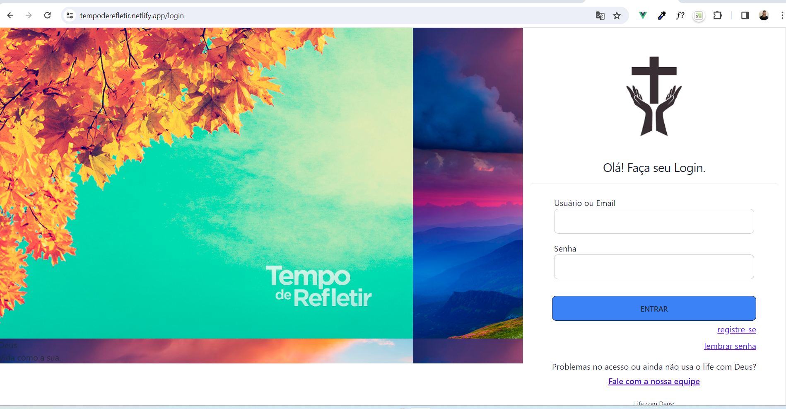
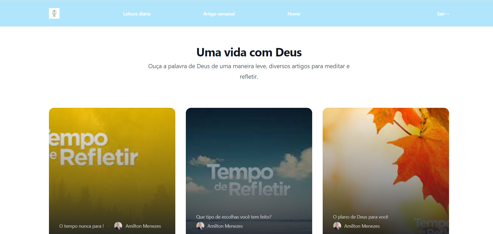
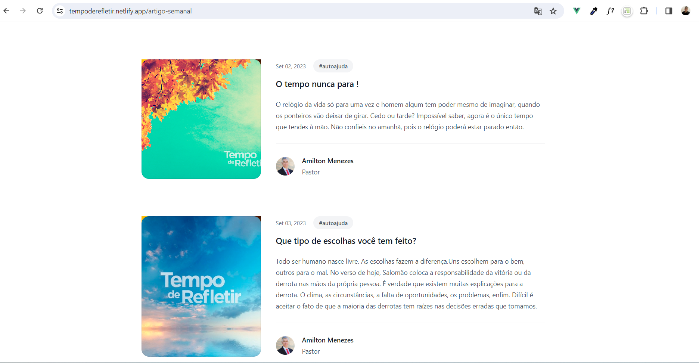
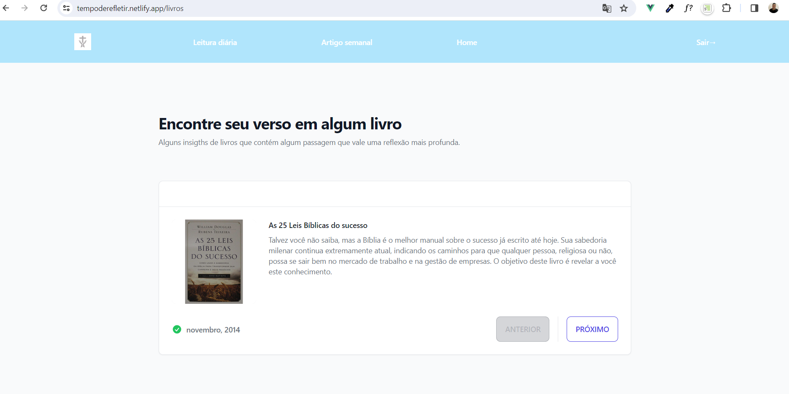

# LWG
[Life with God] tradução: Vida com Deus

## Visão Geral
Este é um projeto full stack que demonstra a aplicação dos meus conhecimentos em desenvolvimento de software. O backend é construído em Node.js, enquanto o frontend utiliza Vue.js e Tailwind CSS. Além disso, há uma versão mobile desenvolvida. O projeto abrange diversos aspectos, desde registros de usuários até a persistência de login com cookies, proteção de rotas com Vue Router, e muito mais.

## Conteúdo Inspirador
Além das funcionalidades técnicas, o projeto também incorpora uma abordagem leve sobre a palavra de Deus, proporcionando uma mensagem positiva aos visitantes. Adicionalmente, compartilho insights de livros que foram significativos em minha jornada.

## Conquistas
Estou orgulhoso de alcançar 100 commits neste projeto, resultado da minha dedicação diária e empenho no seu desenvolvimento.

## Tecnologias Empregadas
**Backend:**
- Node.js
- JWT para proteção e geração de tokens
- Persistência de login com cookies
- Docker para facilitar a geração de builds e imagens

**Frontend:**
- Vue.js 3
- Tailwind CSS
- Vue Router para proteção de rotas
- Utilização de Stores com Pinia
- Requisições HTTP com Axios
- Instâncias e interceptores personalizados com Axios

**Outros Aspectos:**
- Projeto online e rodando
- Separação clara entre frontend e backend
- Banco de dados MongoDB com Mongoose
- Customização de erros da API
- Documentação detalhada da API

**Criação de API com Node Express**

# LAYOUT

Página de login com registro de usuário.

Página home aonde tenho alguns cards.

Algumas mensagens de Deus falando de uma maneira leve , sem crenças absolutas.

Alguns insigts de livros que eu já li.

# API 

Criação de API com Node express

# RODAR PROJETO INTERNET
https://tempoderefletir.netlify.app/LOGIN
registre um usuário e senha e faça login

# RODAR PROJETO LOCAL

npm run api

# ROTAS LOCAL

http://localhost:8000/artigos

# ESTRUTURA

back-end/
|-- controladores/
| |-- artigos.js
| |-- livro.js
|-- db/
| |-- conn.js
| |-- migrateArtigos.js
|-- middlewares/
| |-- authMiddleware.js
| |-- errorMiddleware.js
|-- models/
| |-- artigos.js
| |-- user.js
|-- rotas/
| |-- artigos.js
| |-- livro.js
| |-- usuarios.js
|-- servicos/
| |-- livro.js
|-- .env
|-- app.js
|-- artigos.json
|-- livros.json
|-- package-lock.json
|-- package.json
|-- README.md
|-- teoria.txt

# Documentação de Branchs

## Visão Geral

Este documento fornece uma visão geral das branchs do projeto, destacando suas respectivas funcionalidades e responsabilidades.

## Padrão de Nomenclatura de Branchs

- `feature/<nome-da-funcionalidade>`: Utilizada para desenvolvimento de novas funcionalidades.

## Branchs

### feature/db-data

**Objetivo**: Implementação e ajustes relacionados ao banco de dados.

**Principais mudanças**:

- Implementação da conexão com o banco de dados.
- Criação da nova rota /artigos
- Implementação de migrações.
- criando instância axios para requisições
- Criação da nova rota /artigos
- Consumindo end-point com store no front-end

### feature/back-arquiteturaApi

**Objetivo**: Refatoração da estrutura de pastas da API e organização das funções.

**Plano**:

- Dividir responsabilidades da rota /artigos (criar artigos.js dentro de serviços) ok
- Analisar criação de diretório para Middleware ok
- Revisar tratamento de erros

**Principais mudanças**:

- Realizei todas as tarefas do plano

### feature/front-layoutApp

**Objetivo**: Ajustar layout geral para o proximo deploy

**Plano**:

- ajuste dos itens do header
  ajustar o mobile
  -login será a página inicial
- opções home devem ficar:
  quiz
  leitura diaria( pensar em um nome melhor)
  home
- ocultar opção criar artigo ( será usada mais a frente )
- /artigo-semanal
  vai consumir a rota /artigos da api
  fotos exibidas devem ser aleatórias

**Principais mudanças**:

### feature/deploy

**Objetivo**: colocar projeto no ar

**Plano**:

- estudar melhores opções e deixar back e front em um endereço de internet

**Principais mudanças**:

# back-end

- troca do módulo bcrypt pelo bcryptjs
- construção e execução imagem docker e adição ao dockerhub
- criação de variável de ambiente do DB
- Deploy no render da imagem docker

# front-end

- troca das url's
- removendo importações desnecessárias do projeto
- deploy netlify

# PENDÊNCIAS

- fotos repetidas na rota /home
- melhorar header e footer
- falha ao clicar no card
- console log em produção
- /artigo-semanal tem alguns artigos vazios
- avaliar questionario

- tirar bordas lateral imagem
- refatorar código
- alinhar mobile
